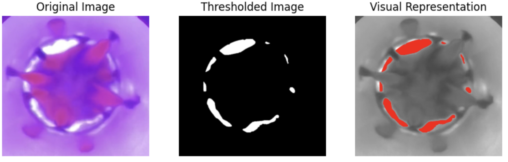
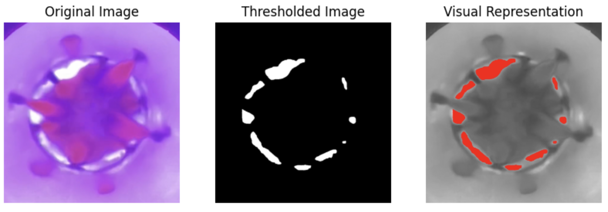

# Choke Coverage Analysis

## Overview

This project is designed to analyze the percentage of white pixels within a specific circular region of an image. It is useful for image analysis tasks that require detecting and quantifying white areas within a defined part of an image, such as evaluating coverage in various types of samples or analyzing light reflection.

The project is split into three main stages:

1. **Image Processing Setup**: Load and preprocess images to grayscale format and define the circular region of interest.
2. **Image Analysis**: Analyze individual images by applying a threshold to detect white pixels and calculate the percentage of white pixels in the defined region.
3. **Batch Processing and Analysis**: Process multiple images, calculate individual percentages of white pixels, and generate an average percentage as well as a visualization of results.

## Project Structure

- `image_processing_setup.py`: Handles loading and preprocessing of images, including converting them to grayscale and defining the circular region of interest.
- `image_analysis.py`: Analyzes individual images by identifying white pixels within a circular region and calculating the percentage.
- `batch_processing_analysis.py`: Processes multiple images, calculates percentages, and visualizes the results.

## How to Use

1. Clone the repository:
   ```bash
   git clone <repository_url>
   cd choke_coverage_analysis
   ```

2. Install the required Python libraries using `pip`:
   ```bash
   pip install -r requirements.txt
   ```
   Alternatively, you can install them manually:
   ```bash
   pip install numpy pillow matplotlib
   ```

3. Place your images in the root directory and update the `image_paths` list in `batch_processing_analysis.py` with the correct file paths.

4. Run the batch processing script to analyze all images:
   ```bash
   python batch_processing_analysis.py
   ```

## Example Output

After running the batch analysis, you will see:

- The percentage of white pixels for each image.
- The average percentage of white pixels across all images.
- A linear plot visualizing the rate of white pixels across the images.
- A visual representation of the measurement

  
## Analysis Results

Here are some example outputs of the image processing:

### Original Image, Thresholded Image, and Visual Representation




## Requirements

- Python 3.x
- Libraries: `numpy`, `pillow`, `matplotlib`

## Contact

Author: Kimia K

Feel free to reach out if you have any questions or suggestions for improvements!

